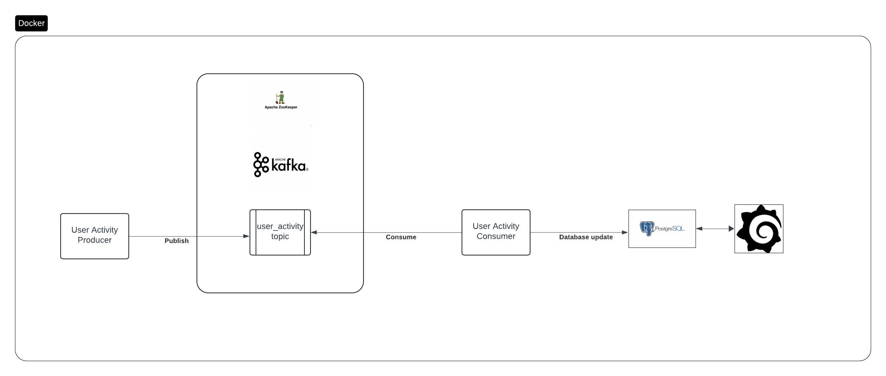

# 📊 Real-Time User Activity Processing Pipeline

This project implements a **fully automated, containerized real-time data processing pipeline** for user activity tracking. It leverages **Kafka**, **PostgreSQL**, **Grafana**, and **Python-based producer/consumer** services.

> ✅ Once set up with `docker-compose up --build`, everything is ready to use — including dashboards with some little modifcation and live data.

---

## 📚 Table of Contents

1. [Problem Statement](#problem-statement)
2. [Solution Overview](#solution-overview)
3. [Architecture Diagram](#architecture-diagram)
4. [Components](#components)
5. [How to Run](#how-to-run)
6. [Prebuilt Dashboards](#prebuilt-dashboards)
7. [Assumptions](#assumptions)
8. [Challenges Faced](#challenges-faced)
9. [What's Next](#whats-next)

---

## 📌 Problem Statement

Based on the problem statement we need to do below 
> - Simulates user events (click, view, scroll)
> - Uses Kafka for message transport
> - Stores processed data in a database
> - Visualizes data using dashboards

---

## ✅ Solution Overview

This application:
- Simulates random user activity events via a Python **producer**
- Publishes them to a Kafka topic: `user_activity`
- Consumes them using a Python **consumer**
- Stores processed events into a **PostgreSQL** table
- Automatically provisions a **Grafana dashboard** with 5 key reports
- All components are managed using **Docker Compose**

Everything is **fully automated**:
```bash
docker-compose up --build
```

> This will:
> - Pull necessary images
> - Start Zookeeper, Kafka, PostgreSQL, Grafana
> - Create the topic `user_activity`
> - Start the producer and consumer
> - Load dashboard and PostgreSQL data source into Grafana

---

## 🧱 Architecture Diagram
 
> 

---

## ⚙️ Components

| Component      | Tech Used         | Description                                           |
|----------------|------------------|-------------------------------------------------------|
| Producer       | Python + Kafka   | Simulates events at irregular intervals               |
| Kafka Broker   | Bitnami Kafka    | Publishes and buffers messages                        |
| Consumer       | Python + PostgreSQL | Consumes messages, transforms and writes to DB     |
| Database       | PostgreSQL       | Stores aggregated event data                          |
| Visualization  | Grafana          | Monitors KPIs through auto-provisioned dashboards     |
| Orchestration  | Docker Compose   | Builds and runs the full stack locally                |

---

## 🚀 How to Run

1. Clone this repository
2. Make sure Docker & Docker Compose are installed
3. Run:

```bash
docker-compose down -v  # optional: clean start
docker-compose up --build
```

4. Open Grafana at [http://localhost:3000](http://localhost:3000)  
   Login: `admin` / `admin`

---

## 📈 Prebuilt Dashboards

Grafana dashboard contains **5 visual reports**:
1. 📊 Total events processed today
2. ⏱️ Event rate per minute
3. 🧩 Event distribution by type
4. 👤 Top 5 active users (last hour)
5. 📆 Data volume growth over time

> All are auto-loaded via provisioning. Just a little update is required as mentioned below 

---

## 📎 Assumptions

- Kafka topic `user_activity` is created dynamically at container startup
- PostgreSQL and Grafana run with default credentials
- Dashboard is generic and supports scaling to other event types
- No authentication required between services (localhost trust)

---

## 🧗 Challenges Faced

- Grafana YAML file was initially misconfigured as a directory mount — fixed by renaming and avoiding conflict
- Getting full automation (topic creation, provisioning, dashboards) to work required careful service order
- Getting kafka to start took some work due to misconfiguration 
- Auto Provision of reports also needed a steep learning curve and took time and works partially with a little change at the end 

---

## 🛣️ What's Could be done more 

- Add Prometheus for advanced alerting
- Persist dashboards and metrics using Grafana volumes
- Extend schema for hourly/daily aggregations

---

## 👨‍💻 Author

Ankit Khare
